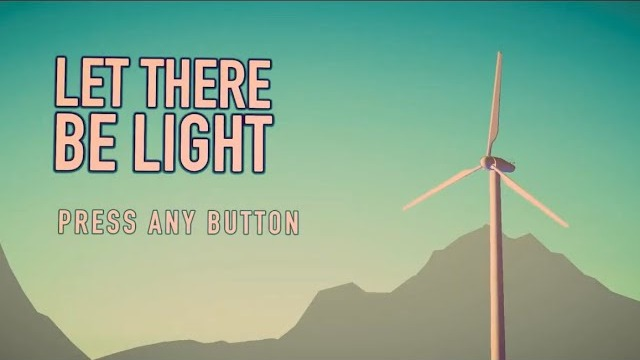

# Let There Be Light

A short first-person story game made in Unity. It runs across three acts and a flashback.

## Demo

[Watch the playthrough](https://youtu.be/E0pImV2HVu8)

## Download and play

1. Download `LetThereBeLight-Windows.zip` from [Releases](https://github.com/huznot/Let-There-Be-Light/releases/latest)
2. Unzip it
3. Open the `Let There Be Light` folder and run `fp game test.exe`

## Run from source

1. Install Unity `6000.2.12f1`
2. Clone this repo, then add the folder in Unity Hub
3. Open `Assets/_Project/Scenes/Act0.unity` and press Play

Scenes play in this order: `Act0` → `Act1` → `Flashback` → `Act2` → `Credits`.

## Layout

| Path | What's in it |
| --- | --- |
| `Assets/_Project` | scenes, scripts, art and audio made for this game |
| `Assets/ThirdParty` | asset store packs |
| `Assets/Resources` | assets loaded at runtime |
| `Assets/Settings` | render pipeline settings |

## License

MIT, see [LICENSE](LICENSE).
